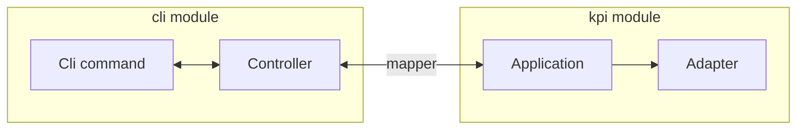

### Schema

```mermaid
  flowchart  LR;
    A[Cli command]  
    B[Controller]  
    C[Application]  
    D[Adapter]
    
    subgraph cli module
    A<-->B
    end
    subgraph kpi module
    B<--mapper-->C
    C-->D
    end
```